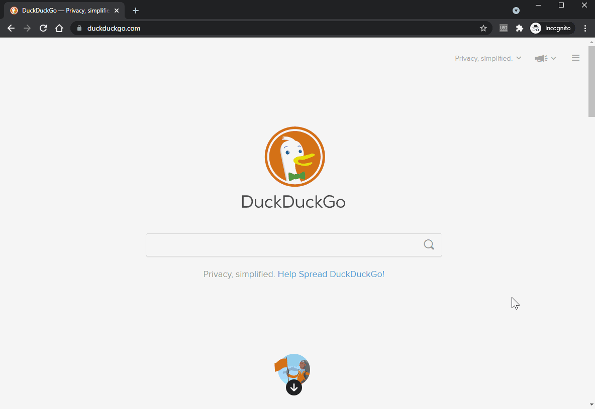

# UbiChr
UbiChr is "Ubiquity for Chrome" - a revived *command line interface* that brings lots of useful command shortcuts to your browser. 

In particular you can:
* **open a command like window (Ctrl+Space) execute commands with arguments and preview the results**
* open new tabs and pass GET or POST parameters (Wikipedia search, dictionary lookup, translate text)
* fetch data via ajax, process it and display on extension popup preview (for example: IMDB movie lookup, currency converter)
* alter current pages (highlight keywords, inverse or remove colors)
* **add your custom JavaScript commands** via built-in editor in a syntax similar to original Ubiquity project 
* utilize powerful features of chrome extension (inject scripts, access cookies, use alarms, bulk save and zip urls, filter opened tabs for text or links, ...)

UbiChr is my humble attempt to create [Ubiquity](https://wiki.mozilla.org/Labs/Ubiquity) alternative for Chrome and Firefox Quantum browsers.



# Installation
To install use Chrome Web Store https://chrome.google.com/webstore/search/ubichr

# How to install dev version
To install latest commited version please follow 'Load the extension' section here https://developer.chrome.com/extensions/getstarted

# License & Origins
MIT license

Most of the code is based on http://github.com/cosimo/ubiquity-opera/

# Adding commands
You can add your custom commands using built-in editor (CodeMirror) or modify commands.js. The syntax is quite simple and self explanatory.
Press Ctrl+Space, type ```edit``` and press Enter.

## Key objects and functions
The most important object of the extension is ```CmdUtils```. It's a global object providing many helper functions and storing all commands. 

The most common function is ```CmdUtils.CreateCommand(cmd)``` which parses ```cmd``` argument and adds new command to UbiChr. Since this is a programming extension it is advised to both read examples below and browse [cmdutils.js](https://github.com/rostok/ubichr/blob/master/cmdutils.js).

## Basic command:
```javascript
CmdUtils.CreateCommand({
    name: "example", 
    description: "A short description of your command.",
    author: "Your Name",
    icon: "http://www.mozilla.com/favicon.ico",
    execute: function execute(args) {
        alert("EX:You input: " + args.text, this);
    },
    preview: function preview(pblock, args) {
        pblock.innerHTML = "PV:Your input is " + args.text + ".";
    },
});
```
Use ```CmdUtils.CreateCommand(cmd)``` and provide object with ```name``` string and ```preview``` and ```execute``` functions. The ```execute``` function takes argument which is an object containing ```text``` property - a single string following command. The ```preview``` function also has ```pblock``` parameter pointing to popup div for various output.

The ```args``` object properties for ```execute``` and ```preview``` are as follows:

* text: text passed as argument
* _selection: true if text is a current selection
* _cmd: current command structure
* _opt_idx: selected option (optional), -1 by default
* _opt_val: value of option element set in data-option-value attribute
* pblock: the preview element in case it will be updated via execute

Also both ```preview``` and ```execute``` functions are bound to command definition object before call allowing access other properties or methods via ```this```.

## Full command definition
The command definition object (refered also as cmd_struct) can have these properties when calling ```CmdUtils.CreateCommand(cmd)```:

| property       | necessary | type                      | info                             |
|----------------|-----------|---------------------------|----------------------------------|          
| name           | yes       | string / array of strings | the actuall command name or names|
| preview        |           | string / function         | if string this will be placed instead of description, function has two arguments first being DOM preview element, second ```args``` object|
| execute        |           | function                  | function called when command is executed, takes a single ```args``` object as argument|
| preview/execute| yes       | function                  | one of these functions is necessary for command to actually do something|
| description    |           | string                    | short information on command shown in preview area|
| author         |           | string / object           | unused feature from original Ubiquity, email or {name,email} object|
| icon           |           | string                    | url to icon/image or unicode or emoji |
| license        |           | string                    | totally unused legacy option|
| homepage       |           | string                    | totally unused legacy option|
| external       |           | bool                      | indicates if command relies on external scripts|
| builtIn        |           | bool                      | true for all built-in commands           |
| help           |           | string                    | additional text expanding description|
| timeout        |           | number                    | if set ```preview```/```execute``` functions will be called after this delay, both functions will be saved as ```preview_timeout```/```execute_timeout```|
| requirePopup   |           | string / array of strings | url(s) of necessary scripts loaded before ```preview``` is called | 
| require        |           | string / array of strings | as above but for ```execute``` function |

## Command with some action
```javascript
CmdUtils.CreateCommand({
    name: "google-search",
    preview: "Search on Google for the given words",
    execute: CmdUtils.SimpleUrlBasedCommand(
        "http://www.google.com/search?client=opera&num=1&q={text}&ie=utf-8&oe=utf-8"
    )
});
```

Note that execute is created using ```CmdUtils.SimpleUrlBasedCommand()``` the output function will substitute {text} and {location} template literals with actual argument and current tab url.

## Getting outside data with async / await
```javascript
CmdUtils.CreateCommand({
    name: "imdb",
    description: "Searches for movies on IMDb",
    icon: "http://www.imdb.com/favicon.ico",
    preview: async function preview(pblock, {text: text}) {
        pblock.innerHTML = "Searches for movies on IMDb";
        var doc = await CmdUtils.get("http://www.imdb.com/find?q="+encodeURIComponent(text)+"&s=tt&ref_=fn_al_tt_mr" );
        pblock.innerHTML = "<table>"+jQuery("table.findList", doc).html()+"</table>";
    },
    execute: CmdUtils.SimpleUrlBasedCommand("http://www.imdb.com/find?q={text}&s=tt&ref_=fn_al_tt_mr")
});
```

Here the ```preview``` function is defined with ```async``` keyword. This will allow to avoid callback hell when getting data with GET request (```CmdUtils.get(url)```). Note the destructuring assignment singling out the ```text``` parameter in ```preview``` function. Note: final implementation uses one liner with ```jQuery.load()```.


## Search command with iframe preview
```javascript
CmdUtils.makeSearchCommand({
  name: ["qwant"],
  description: "Searches quant.com",
  author: {name: "Your Name", email: "your-mail@example.com"},
  icon: "https://www.qwant.com/favicon-152.png?1503916917494",
  url: "https://www.qwant.com/?q={QUERY}&t=all",
  prevAttrs: {zoom: 0.75, scroll: [100/*x*/, 0/*y*/], anchor: ["c_13", "c_22"]},
});

```
The ```CmdUtils.makeSearchCommand()``` (provided by Sebres) simplifies even more common web fetching. Instead of loading part of HTML and parsing it with JQuery an iframe is created in UbiChr results area. Extra parameters allow to scale and translate it.

## Commands with options
Version 0.1.0.16 adds options inside preview. To define them just mark any DOM element with data-option attribute and optional data-option-value. Once preview is shown you can navigate through options using Ctrl+up or Ctrl+down keys. Executing command with Enter will pass extra properties into args object. Here's a brief example:
```javascript
CmdUtils.CreateCommand({
    name: "optionexample",
    execute: function execute(args) {
      	CmdUtils.setTip("chosen option idx:"+args._opt_idx+" chosen option val:"+args._opt_val);
    },
    preview: function preview(pblock, args) {
        pblock.innerHTML  = "<div data-option data-option-value=one>option 1</div>";
        pblock.innerHTML += "<div data-option data-option-value=two>option 2</div>";
        pblock.innerHTML += "<div data-option data-option-value=thr>option 3</div>";
        pblock.innerHTML += "<div data-option data-option-value=fou>option 4</div>";
        pblock.innerHTML += "<div data-option data-option-value=fiv>option 5</div>";
    },
});

```
A more advanced example is IMDB movie lookup command. Unnecessary elements were removed for clarity.
```javascript
CmdUtils.CreateCommand({
    name: "imdb",
    preview: async function define_preview(pblock, {text: text}) {
        pblock.innerHTML = "Searches for movies on IMDb";
        if (text.trim()!="") 
        jQuery(pblock).loadAbs("http://www.imdb.com/find?q="+encodeURIComponent(text)+"&s=tt&ref_=fn_al_tt_mr table.findList", ()=>{
            jQuery(pblock).find(".findResult").each((i,e)=>{
                jQuery(e).attr("data-option","");
                jQuery(e).attr("data-option-value", jQuery(e).find("a").first().attr("href"));
            });
        });
    },
    execute: function execute(args) {
        var opt = args._opt_val || "";
        if(opt.includes("://")) 
            CmdUtils.addTab(opt);
        else {
            execute = CmdUtils.SimpleUrlBasedCommand("http://www.imdb.com/find?s=tt&ref_=fn_al_tt_mr&q={text}");
            execute(args)
        }
    }
});
```
Inside ```preview``` after the results are loaded jQuery is used to iterate over all ```.findResult``` elements and mark them with ```data-option``` attribute. Also ```data-option-value``` is set with URL.

The ```execute``` function check if option was set and if it is an URL (includes ```://```). If so another browser tab is added. In case it was not defined standard tab with search results is opened.

## Custom option selection event
Selecting options triggers custom 'data-option-selected' event passed to selected element. In example below command searches Emojipedia for glyphs based on decription. Results are filtered and shown as a preview. Finally each of them is attributed with 'data-option'. Also, a custom event handler (final line) is attached that copies single glyph/emoji to clipboard.

```javascript
CmdUtils.makeSearchCommand({
    name: ["emoji"],
    description: "Search Emojipedia",
    icon: "https://emojipedia.org/static/img/favicons/favicon-32x32.png",
    execute: CmdUtils.SimpleUrlBasedCommand("https://emojipedia.org/search/?q={text}"),
    url: "https://emojipedia.org/search/?q={QUERY}",
    timeout: 250,
    preview: function preview(pblock, args) {
        if (args.text === "")
            pblock.innerHTML = "enter EMOJI description";
        else {
            pblock.innerHTML = "";
          	jQuery(pblock).loadAbs("https://emojipedia.org/search/?q=" + encodeURIComponent(args.text)+ " div.content", ()=>{
              pblock.innerHTML = "<font size=12>"+jQuery("span.emoji", pblock).map((i,e)=>e.outerHTML).toArray().join("")+"</font>";
              jQuery("span", pblock).each((i,e)=>{
                jQuery(e).attr("data-option","");
                jQuery(e).attr("data-option-value", jQuery(e).find("a").first().attr("href"));
                jQuery(e).on("data-option-selected", e=>CmdUtils.setClipboard($(e.target).html()) ); // custom event handler
              });
            });
        }
    }
});

```

## Open tab, post a form and dodge anti CSRF token
The example below opens an URL and also fills a form than is finally submitted. This particular approach is suitable for to create a shortcut to all non-standard pages operating on forms with parameters passed with POST and some kind of CSRF protection (token, cookie, etc). 

```javascript
CmdUtils.CreateCommand({
    name: "post-form-shortcut",
    execute: function execute(args) {   
      var q = args.text; 
      CmdUtils.backgroundWindow.eval( `
	   var callback = (tab) => {
            chrome.tabs.executeScript( tab.id, { code: \`
              document.querySelector("input[name='inputfield']").value = "${q}";
			  document.querySelector("button[name='submitbutton']").click();
			\`} );
          	chrome.tabs.onCreated.removeListener( callback );
       };
       chrome.tabs.onCreated.addListener( callback );
       `);
       CmdUtils.addTab("https://site/formurl");
    },
});
```

UbiChr command creates internal chrome listener that is fired upon new tab being opened. The listerer callback executes JS into a page that fills the form and submits it and finally removes the callback. Please note, that the example above has no tab url check in place. 

## Commands that inject external JavaScript
Build 1.0.0.31 includes two commands that rely on external sources. These are `allow-text-selection` that removes anti selection by overriding `user-select: none` CSS style, and `grayscale` (or `greyscale`) which just disables colors. Both commands inject JS source taken from CDN and as a precaution include `external: true` attribute. Be aware that the CDN provided source may change anytime.

The intention here is to convert simple bookmarked javascript into typical commands. The author of the original JS scripts or the bookmarklets is [Alan Hogan](https://github.com/alanhogan/bookmarklets).

```javascript
CmdUtils.CreateCommand({
    name: "allow-text-selecion",
    author: "Alan Hogan",
    icon: "Ꮖ",
    external: true,
    description: "Allows text selection by undoing user-select:none CSS rules.",
    homepage: "https://alanhogan.com/bookmarklets",
    execute: function execute(args) { CmdUtils.inject("https://cdn.jsdelivr.net/gh/alanhogan/bookmarklets/enable-text-selection.js"); },
});

CmdUtils.CreateCommand({
    name: ["grayscale","greyscale"],
    author: "Alan Hogan",
    icon: "🎨",
    external: true,
    description: "Removes colors.",
    homepage: "https://alanhogan.com/bookmarklets",
    execute: function execute(args) { CmdUtils.inject("https://cdn.jsdelivr.net/gh/alanhogan/bookmarklets/grayscale.js"); },
});
```
## Update handlers
The background script runs ```CmdUtils.updateActiveTab()``` method on couple of chrome's events
(onUpdated,onActivated,onHighlighted). Version 0.1.0.32 adds possibility to attach/remove your custom handlers to ```CmdUtils.updateActiveTab()```. This is managed via:
* `CmdUtils.addUpdateHandler(name, handler)` which adds named handler function to ```CmdUtils.updateHandlers``` array, note that handler must be a function
* `CmdUtils.removeUpdateHandler(name)` which removes named handler from 
* `CmdUtils.updateHandlers` which is an array of `{name,handler}` objects
In particular the new `highlight`/`mark` command uses these methods to add permanent highlighting of chosen keywords.

# Sharing Commands
All commands can be shared with an experimental `command-gist name` statement. This will open gist.github.com and fill in the form assuming you are already logged as GitHub user. It is up to you to decide if the source should be sercret or public.

To search for commands shared by others go to https://gist.github.com/search?q=ubichr. For now commands can be added only by manual cut&paste of the source to the editor window.

In case you just want to share command via other means execute `command-source name` to copy source to clipboard.

# Keyboard shortcuts
## Command popup
- Enter - execute current command
- Shift+Enter - execute to inactive tab
- Ctrl+C - copy preview output to clipboard
- F5 - reload the extension
- ↑ / ↓ - select command suggestion
- Tab - expand current suggestion to default command name
- Space - remove command parameters; works only when input is fully selected (useful for calling last command with different parameter)
- Ctrl+↑ / ↓ - select preview option
- Ctrl+R / Alt+F8 - shows command history, enter parameter to filter results
- Ctrl+P / Ctrl+E - previous command
- Ctrl+N / Ctrl+X - next command

## Scripts editor
- Ctrl-/ - comment block of code
- Ctrl-S - save scripts to file
- Ctrl-F - search
- Ctrl-G - go to next search location

# Alternatives
Svalorzen has forked UbiChr and created UbiShell which has more shell like UI with piping and command options. Check it out here: https://github.com/Svalorzen/UbiShell

# Privacy policy
As Google requests privacy policy [here's one](https://github.com/rostok/ubichr/wiki/Privacy-Policy). Do not worry though, UbiChr doesn't collect any of your data.