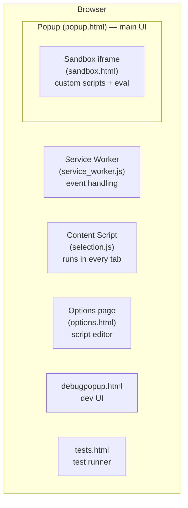

# UbiChr V3 — Architecture Specification

## Overview

UbiChr is a Chrome extension (Manifest V3) implementing a Ubiquity-style command launcher. Users invoke it via keyboard shortcut, type a command name with arguments, and get a live preview before executing.

---

## Execution Contexts

MV3 splits code across multiple isolated contexts. Each has different capabilities and restrictions.



---

## 1. Popup — `popup.html`

**What it is:** The main extension UI, shown when the user presses Ctrl+Space or clicks the icon.

**Scripts loaded (in order):**
```
lib/jquery-3.6.0.min.js
lib/jszip.min.js
utils.js          — URL helpers, misc utilities
cmdutils.js       — CmdUtils object, all built-in APIs
commands.js       — all built-in command definitions
commands-legacy.js — legacy/deprecated commands (still loaded)
context.js        — CmdUtils extensions (loadAbs, absolutize, etc.)
core.js           — MV3 compatibility shim (backgroundPage = window)
popup.js          — UI logic, sandbox bridge, event handlers
```

**CSP:** `script-src 'self'` — no external scripts, no eval.

**Access:**
- Full Chrome extension API (`chrome.*`)
- DOM of its own page
- `navigator.clipboard` (with `clipboardRead`/`clipboardWrite` permissions)
- Cross-origin XHR/fetch via `host_permissions` (`http://*/*`, `https://*/*`)
- Can reach other extension pages via `chrome.extension.getViews()`

**Key globals:**
| Global | Defined in | Purpose |
|--------|-----------|---------|
| `CmdUtils` | cmdutils.js | Command API (tabs, clipboard, ajax, etc.) |
| `Utils` | utils.js | URL parsing utilities |
| `jQuery` / `$` | jquery | DOM manipulation |
| `ubiq_*` functions | popup.js | UI: show/hide commands, preview, input |

**CmdUtils key properties set in popup:**
```js
CmdUtils.popupWindow    // = window (self-reference)
CmdUtils.backgroundWindow // = window (MV3: no background page)
CmdUtils.sandboxFrame   // = iframe#sandbox-frame element
CmdUtils.setPreview     // = ubiq_set_preview
CmdUtils.CommandList    // array of all registered commands
CmdUtils.selectedText   // from service worker via chrome.storage.session
CmdUtils.active_tab     // from service worker via chrome.storage.session
```

**Sandbox bridge (popup.js):**
- Listens for `postMessage` from sandbox iframe
- Handles: `sandbox-ready`, `register-command`, `pblock-update`, `chrome-call`, `set-cmd-prop`, `eval-ok`, `eval-error`, etc.
- Proxies `chrome.*` calls from sandbox (fetch, tabs.create, notifications, etc.)
- Stub commands forward `preview`/`execute` to sandbox via postMessage

---

## 2. Sandbox — `sandbox.html`

**What it is:** A sandboxed iframe embedded in popup.html. Its sole purpose is to safely `eval()` user custom scripts (eval is forbidden in extension pages by MV3 CSP).

**Scripts loaded:**
```
lib/jquery-3.6.0.min.js
sandbox.js          — proxy CmdUtils, postMessage bridge, eval runner
```

**CSP:** `sandbox allow-scripts; script-src 'self' 'unsafe-eval' https://cdnjs.cloudflare.com`
- `unsafe-eval` allowed → custom scripts can use eval
- `cdnjs.cloudflare.com` allowed → custom scripts can load libraries from CDN

**No access to:**
- `chrome.*` APIs (sandboxed page has no extension context)
- Cross-origin XHR (origin is `null` → CORS blocks everything)
- DOM of popup (different frame)

**Communication:** exclusively via `window.postMessage` / `parent.postMessage`.

**Sandbox CmdUtils — proxied APIs:**
All `chrome.*` calls are forwarded to popup via `chromeProxy(method, args)` which sends a `chrome-call` message and returns a Promise resolving when popup sends back `chrome-result`.

| Sandbox API | Implementation |
|-------------|---------------|
| `CmdUtils.addTab(url)` | → `chromeProxy('tabs.create', ...)` |
| `CmdUtils.ajaxGet(url, cb)` | → `chromeProxy('fetch', [url])` → XHR with credentials in popup |
| `CmdUtils.get(url)` | → `chromeProxy('fetch', [url])` → returns `jQuery(html)` |
| `CmdUtils.setClipboard(t)` | → `postMessage {type:'set-clipboard'}` |
| `CmdUtils.getClipboard()` | → returns `CmdUtils._clipboardText` (cache sent from popup) |
| `CmdUtils.notify(msg)` | → `chromeProxy('notifications.create', ...)` |
| `CmdUtils.setPreview(html)` | → `postMessage {type:'set-preview'}` |
| `$.fn.loadAbs(url, cb)` | → `chromeProxy('fetch', ...)` → parse HTML → update pblockEl |
| `$.fn.blankify()` | inline jQuery plugin |
| `$.fn.absolutize(base)` | inline jQuery plugin |

**jQuery plugins available in sandbox:** `loadAbs`, `blankify`, `absolutize`
*(cmdutils.js jQuery plugins like `loadAbs` are NOT auto-available — they must be defined in sandbox.js)*

**Custom command lifecycle:**
```
1. popup sends {type:'eval', code} to sandbox
2. sandbox evals code → CmdUtils.CreateCommand() called
3. sandbox stores command in sandboxCommands{}
4. sandbox sends {type:'register-command', name, previewSrc, executeSrc, ...} to popup
5. popup creates stub command in CmdUtils.CommandList
6. User types command → popup sends {type:'preview', name, args, clipboardText} to sandbox
7. sandbox runs preview(pblockEl, args) → DOM updates → MutationObserver fires
8. MutationObserver sends {type:'pblock-update', html} to popup
9. popup sets ubiq-command-preview innerHTML
```

**Clipboard propagation:**
```
tests.html:CmdUtils.setClipboard(text)
  → updates _clipboardText in all chrome.extension.getViews() windows
  → popup CmdUtils._clipboardText is set synchronously
  → popup sends clipboardText in next preview message
  → sandbox caches in CmdUtils._clipboardText
  → sandbox CmdUtils.getClipboard() returns correct value
```

---

## 3. Service Worker — `service_worker.js`

**What it is:** The MV3 background page replacement. Stateless, event-driven, no DOM.

**Access:** Full `chrome.*` API, no DOM, no jQuery.

**Responsibilities:**
- Listens for tab events (`tabs.onActivated`, `tabs.onUpdated`)
- Stores `selectedText` and `active_tab` in `chrome.storage.session`
- Popup reads these on load via `chrome.storage.session.get()`

**No access to:** DOM, popup's CmdUtils, window object.

---

## 4. Content Script — `selection.js`

**Runs in:** Every web page (matches `<all_urls>`).

**Purpose:** Captures selected text and sends it to the service worker when the user selects text on a page.

**Access:** Page DOM (isolated world), `chrome.runtime.sendMessage`.

---

## 5. Options Page — `options.html`

**What it is:** Custom script editor, opened as a tab.

**Scripts:** Same base scripts as popup. Lets users write and save custom JavaScript commands to `chrome.storage.local` under key `customscripts`.

**No sandbox:** Custom scripts are only saved here, not eval'd. Eval happens in the sandbox when the popup opens.

---

## 6. Debug Pages

### `debugpopup.html`
Full popup UI + options page embedded side-by-side. Loads same scripts as popup plus sandbox iframe. DevTools-friendly — `CmdUtils` accessible in console. `popupCmdUtils()` function returns popup's live CmdUtils.

### `tests.html`
Test runner. Loads all popup scripts + sandbox-bridge.js. Opens popup tabs in test mode (`popup.html#testCOMMAND`) and communicates via `chrome.extension.getViews()`.

---

## 7. Automated Test Harness — `harness/`

Playwright-driven feedback loop: launches an **isolated** Chromium (Playwright's own binary + `harness/.profile` — never the user's browser) with the extension loaded via `--load-extension`, seeds the newest `custom-cmds/ubichr-custom-scripts-*.js` into `chrome.storage.local`, and drives the extension pages.

```
cd harness
npm install && npx playwright install chromium   # one-time setup

node run-tests.mjs                     # full suite, batches of 8 (clipboard tests serialized)
node run-tests.mjs --filter=clip       # only tests whose name contains "clip" (tests.html?f=clip)
node run-tests.mjs --only=calc,imdb    # exactly these tests
node run-tests.mjs --serial            # one at a time (slowest, most deterministic)
node run-tests.mjs --parallel          # tests.html '#start' (fast but racy — see below)
node run-command.mjs "calc 2+2"        # drive one command in popup.html, dump preview
node run-command.mjs "cliptab" --clip="a\tb\nc\t1" --exec   # preseed clipboard, execute
node run-command.mjs "invert" --target=https://example.com --exec --shot=inv.png
                                       # wire a page as active_tab, before/after screenshots
node run-command.mjs "imdb blade runner" --keep             # leave browser open to inspect
node probe.mjs                         # diagnostics: command counts, sandbox messages
```

Results land on stdout and in `harness/last-results.json`; a failed run exits non-zero.
`unittests <substring>` inside UbiChr opens `tests.html?f=<substring>` — same filter as `--filter`.

**Why full parallelism is off by default:** the built-in parallel runner (`#start`) opens all test popups at once — `setClipboard` from any test propagates to *every* open popup (clobbering clipboard-based tests), and ~40 simultaneous 200KB sandbox evals are slower than popup.js's 2s test-mode fallback, so inputs get typed before custom commands register. These are test-runner races, not extension bugs. Default batching (8 at a time, clipboard-writers alone) keeps runs fast and honest.

**Environment caveats:** fresh profile has no cookies (`cookies`/`killcookies` tests report empty), no "Allow User Scripts" toggle (`endcode` flows unavailable), and `navigator.clipboard` HTML read/write needs window focus (internal `setClipboardHTML`/`getClipboardHTML` tests are focus-sensitive).

---

## Communication Map

```mermaid
sequenceDiagram
    participant CS as Content Script
    participant SW as Service Worker
    participant POP as Popup
    participant SB as Sandbox iframe
    participant OPT as Options page

    CS->>SW: sendMessage(selectedText)
    SW->>SW: storage.session.set({selectedText, active_tab})
    POP->>SW: storage.session.get()
    SW-->>POP: {selectedText, active_tab}

    OPT->>OPT: storage.local.set({customscripts})
    POP->>POP: storage.local.get(customscripts)
    POP->>SB: postMessage {type:'eval', code}
    SB-->>POP: postMessage {type:'register-command', ...}

    POP->>SB: postMessage {type:'preview', args, clipboardText}
    SB->>SB: run preview(pblockEl, args)
    SB-->>POP: postMessage {type:'pblock-update', html}

    SB->>POP: postMessage {type:'chrome-call', method, args}
    POP->>POP: XHR / chrome.tabs.create / etc.
    POP-->>SB: postMessage {type:'chrome-result', result}
```

---

## MV3 Constraints & Solutions

| MV2 Feature | MV3 Restriction | Solution |
|-------------|----------------|----------|
| `eval()` in extension pages | Blocked by CSP | Sandbox iframe with `unsafe-eval` |
| Background page (persistent) | Replaced by Service Worker | State in `chrome.storage.session` |
| `chrome.tabs.executeScript({code})` | String eval removed | `chrome.scripting.executeScript({func, args})` |
| `chrome.extension.getBackgroundPage()` | Removed | Message passing or `chrome.storage` |
| `chrome.browserAction` | Renamed | `chrome.action` |
| Remote scripts via `<script src>` | CSP `script-src 'self'` | Bundle locally in `lib/` |
| jQuery `loadAbs` in custom commands | Sandbox has null origin (CORS) | `loadAbs` in sandbox proxies fetch through popup XHR with credentials |

---

## Command Registration Flow

### Built-in commands (`commands.js`)
```
popup.html loads → commands.js executes → CmdUtils.CreateCommand() called
→ command stored in CmdUtils.CommandList[] with builtIn: true
→ preview/execute run directly in popup context (sync)
```

### Custom commands (user scripts via options)
```
popup opens → sandbox-ready → loadCustomScripts()
→ chrome.storage.local.get('customscripts')
→ sends {type:'eval', code} to sandbox
→ sandbox evals → CmdUtils.CreateCommand() called
→ register-command sent to popup
→ popup creates sandbox stub (builtIn: false)
→ stub's preview/execute: postMessage to sandbox → sandbox runs → pblock-update back
```

**Priority:** Built-in commands are NOT replaced by custom commands with the same name.

---

## Clipboard Architecture

```
setClipboard(text):
  1. CmdUtils._clipboardText = text  (sync cache)
  2. chrome.extension.getViews() → propagate to all extension tabs (sync)
  3. navigator.clipboard.writeText(text)  (async, system clipboard)

getClipboard():
  → returns CmdUtils._clipboardText  (sync, from cache)

readClipboard():  [async]
  → navigator.clipboard.readText() → updates _clipboardText

getClipboardHTML(): [async]
  → navigator.clipboard.read() → extracts text/html ClipboardItem

setClipboardHTML(html): [async]
  → navigator.clipboard.write([ClipboardItem{text/html, text/plain}])
```

---

## Key Files

| File | Context | Purpose |
|------|---------|---------|
| `manifest.json` | — | Extension manifest, permissions, CSP |
| `service_worker.js` | Service Worker | Tab events, session state |
| `selection.js` | Content Script | Selection capture |
| `cmdutils.js` | Popup | Core CmdUtils API, clipboard, AJAX, history |
| `utils.js` | Popup | URL utilities |
| `commands.js` | Popup | ~2500 lines of built-in commands |
| `context.js` | Popup | jQuery plugins (loadAbs, absolutize, blankify) |
| `core.js` | Popup | MV3 compatibility (backgroundPage = window) |
| `popup.js` | Popup | UI, sandbox bridge, chrome-call proxy |
| `sandbox.js` | Sandbox | Proxy CmdUtils, jQuery plugins, eval runner |
| `sandbox.html` | Sandbox | Sandboxed iframe host |
| `sandbox-bridge.js` | Tests/Debug | Shared sandbox message handler (no popup.js) |
| `options.js` | Options | Script editor, save to storage |
| `debugpopup.js` | Debug | Opens options alongside popup UI |
| `tests.js` | Tests | Test framework, test definitions |
| `lib/jquery-3.6.0.min.js` | All pages | jQuery |
| `lib/jszip.min.js` | Popup | JSZip (bundled, for `save` command) |
| `lib/mark.min.js` | Popup | Mark.js (bundled, for `mark` command) |
